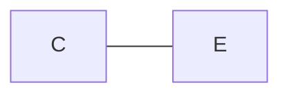
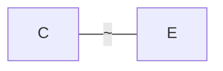
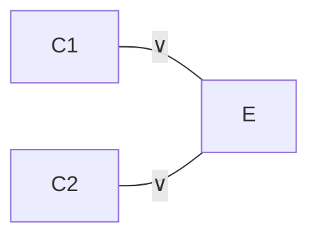
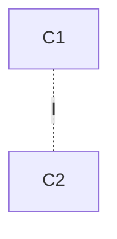
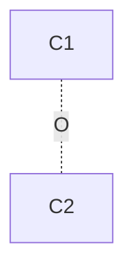
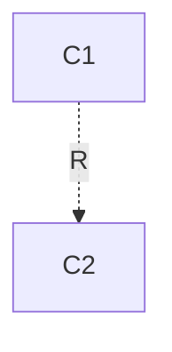
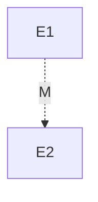
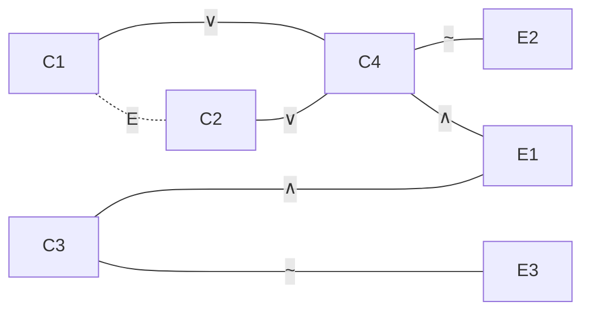

# Ch 5. 戴上眼罩测试软件
本章描述最常用、最有效的软件测试技术，主要从黑盒测试的角度解释如何测试软件。

## 动态黑盒测试：戴上眼罩测试软件
不深入代码细节的测试方法是一种**动态黑盒测试**。

程序需要运行，软件测试员像用户一样使用它，因而是**动态**的；测试员不需要了解软件的内部结构，只需要关注软件的功能是否符合需求，这就是**黑盒**。

- **测试用例**：进行测试时使用的特定输入、预期输出及测试的步骤。

:::tip
永远牢记软件测试 [第一条原则](./ch3-essence-of-testing.md#完全测试程序是不可能的)，*完全测试程序是不可能的*。

选择测试用例是测试员最重要的一项任务。要准确评估风险，把**无穷尽的可能性**减少到**可以控制的范围**。
:::

当采用大爆炸模式或边写边改模式时，能够供测试员参考的产品说明书可能并不完整或根本没有，这就需要测试员把*软件本身*当做产品说明书，开展 [第四章](./ch4-check-spec.md) 中的静态黑盒测试，一边了解软件的功能，一边再开展动态黑盒测试，较为系统地测试软件。

## 通过性测试和失效性测试
通过（Pass）和失效（Fail）是软件测试中最基本的两个结果。同样地，**通过性测试**和**失效性测试**是软件测试中最基本的两种测试方法。

- **通过性测试**：测试软件是否符合需求，是否能够正常工作。重在检查**正常情况**下软件是否存在问题。
- **失效性测试**（或**错误强制测试**）：测试软件在**异常情况**下是否能够正常工作。重在检查软件是否能够**容错**。

:::warning[注意]
**总是应该先进行通过性测试，再进行失效性测试。**

在用苛刻的极端条件测试软件前，测试员往往会发现软件在正常情况下就存在不少问题。
:::

## 选择测试用例：等价类划分
**等价类划分**（Equivalence partitioning / classing）是一种常用的测试用例设计方法，它分步骤地将无限的测试用例缩减到有限的测试用例，却拥有等价的测试效果。

- **等价类**：具有相同功能和特性的输入数据的集合，或是测试相同目标或软件缺陷的输入数据的集合。
  - ⭐ **有效等价类**：包含有效输入数据的等价类，用于通过性测试。
  - ⭐ **无效等价类**：包含无效输入数据的等价类，用于失效性测试。

:::info
划分等价类并没有固定的标准，取决于测试员对软件的理解和经验。

例如，测试员可能将某个功能的不同触发方式划分为数种等价类，而在对软件质量更有信心后，可能会**将这些等价类合并**。

也正是因为这种主观性，等价类划分也可能导致漏掉一些重要的测试用例。说到底，等价类划分仍然是一种**不完全测试**，不可避免地存在风险。
:::

构造等价类后，应当从等价类中挑选**典型**的测试用例，保证有效等价类和无效等价类都能**单独**地覆盖。这就是说，**不要**选择两个等价类中的测试用例，因为这样的测试用例可能会导致测试结果的**混淆**。

## 数据测试
狭义的软件大体上可以分为两个部分：**数据**和**程序**（也就是**处理数据的算法**），由此测试也可以分为**数据测试**和**程序测试**。

数据测试所要面临的第一个难题就是**数据的海量性**——*没错，[第一原则](./ch3-essence-of-testing.md#完全测试程序是不可能的) 仍然在这里发挥作用*——因此，开展等价类划分分而治之是必不可少的步骤。

下面给出一些常见的等价类划分原则，可以帮助测试员更好地构造数据测试用例。

### 选择测试用例：边界条件
边界条件是特殊情况。我们之所以选择边界条件，是基于以下的事实：**编程从根本上就更容易在边界条件处出错**。

这有点像*归纳法*的思想：如果一个程序在边界条件下能够正常工作，那么它在其他情况下也**大概率**能够正常工作。

#### 边界条件类型
**边界条件**是指软件运行在计划操作界限的边界的情况。通常来说，下述特征属于边界条件：
- **第一个**和**最后一个**；
- **最小**和**最大**；
- **开始时**和**结束时**。
- **空**和**满**（注意不是**非空**，这是一般情况）。
- ……

考虑输入值的实际应用意义（例如**数量**、**速度**等）能够更快地找到边界条件。

:::note
想起一张 meme：
> 鸡兔同笼问题里算出共有 -1 只鸡的你 be like
:::

#### 测试边界
仅仅测试边界点是不够的，最好是还能测试边界的两侧：一边测试刚好超过边界的**无效数据**，另一边测试刚好在边界内的**有效数据**。

#### ⭐ Paul C. Jorgensen 公式
设 $n$ 为存在边界值的参数个数，$m$ 为边界值条件数，则有

- **$4n+1$ 公式：基本边界测试**
  - 每个参数取 $min$，$min+1$, $max‐1$, $max$ 各一次，
同时其他参数取典型值 $nom$；最后全部参数取典型值 $nom$，额外记一次。
- **$6n+1$ 公式：健壮性边界测试**
  - 在基本边界测试基础上，为每个参数增加 $min‐1$ 和 $max+1$ 的测试。
- **$3m$ 公式：边界条件测试**
  - 每个条件值 $c_i$ 取 $c_i-1$, $c_i$, $c_i+1$ 各一次。

### 选择测试用例：次边界条件
上述的普通边界条件是很容易在产品说明书或软件的过程中找到的，然而有些边界条件却隐藏在软件内部，最终用户很难发现，软件测试员却必须对其进行测试。这就是**次边界条件**（Sub-boundary condition）或者**内部边界条件**（Internal boundary condition）。

换言之，次边界条件是软件的**隐性边界条件**。

#### 次边界条件类型：数值
计算机内部，任何数据都是通过二进制数表示的，因此 **2 的幂次方**是一个重要的次边界条件，在等价划分时有时需要特别注意。

:::info
有些安全隐患就是由于程序员没有考虑到这些次边界条件而导致的，例如**数值溢出**（$32767 + 1 = -32768$）。
:::

#### 次边界条件类型：字符编码
无论是 ASCII 还是 Unicode，字符编码都有其特殊的边界条件。例如，ASCII 中的**控制字符**和**可显示字符**，Unicode 中的**基本多文种平面**和**辅助多文种平面**。

此外，还需要考虑用户合法输入在这些临界处的处理方式。例如，如果某个被测的文本框只能输入 ASCII 数字，那么就要考虑输入 `/` （ASCII 47，在 `0` 前）和 `:` （ASCII 58，在 `9` 后）的情况。

### 选择测试用例：默认、空白、空值、零值和无
> Default, Empty, Blank, Null, Zero, and None

无论你如何称呼这种**缺少用户输入**的情形——不是错误输入也不是正确输入，而是*什么都没有*——它们都是软件测试中需要注意的一种情况。

好的软件会尝试**提示用户错误输入**，别的软件也会尝试**自动填充某个默认值**；当然，什么也不做直到内部逻辑抛出异常或者恐慌的依然大有“软件”在。

:::note
个人认为，自动填充默认值虽然给用户省了一些事，但是也可能会导致用户**不知不觉**地提交了错误的数据。更要命的是，测试时可能漏掉软件错误地认为用户没有输入（实际上有输入）而自动填充的问题。

这同样告诉我们，**默认值**也并非解决一切空白输入问题的万能药。
:::

由于这种情况下程序一般会执行不同的路径，因此最好不要将其与现有的有效或无效等价类划分在一起。

### 选择测试用例：垃圾数据
:::quote[[德] 弗里德里希·威廉·尼采《试观此人》]

想在善和恶中作造物主的人，必须首先是个**破坏者**，并砸烂一切价值。也就是说，最大的恶属于最高的善。不过，后者是创造性的善。

:::

- **垃圾数据**：**无意义**、**无效**、**不合理**的数据，它们可能是用户输入错误、软件错误、或者是**恶意**的。

**砸烂一切**！如果说上述的所有测试方法都是有迹可循的严谨技术的话，那么这里所介绍的就是**纯粹的、混沌的破坏**。

测试员必须假定用户（或更加中性地说，软件的最终使用者）不一定会遵循*常人的思路*，而是可能会**故意**或**无意**地输入一些**不合理**的数据。要知道，*用户可不会责怪自己，错的一定是软件！*

所以，在规规矩矩地完成上面的那些技术测试后，测试员也需要适当放松一下——**搞搞破坏！** 不必为此愧疚，测试员所做的一切都是为了让软件更加完善。

:::example
*释放你创造力和想象力的时候到了！*

- 软件要求输入**数字**？那就用字母和符号淹没它！
- 软件要求输入**日期**？那就试试千百年前的原始时代或者宇宙尽头来让它崩溃！
- 高精度操作要求？狂按键盘——别忘了，这是在**测试容错性**！
- ……
:::

某种程度上，这和计算机安全领域的模拟攻防战是一致的。要想造出更加健壮和安全的软件，就必须**不断地挑战**它，让它能够抵御**最恶劣**的条件。

## 状态测试
当数据测试完成后，测试员需要考虑过不同的**状态**验证程序的逻辑流程。软件通过代码执行不同的分支，触发某些数据位，设置一些变量，读取一些数据，最终转入另外一个状态。

- **软件状态**：软件当前所处的条件或者模式。

### 选择测试用例：状态转换图
尽管软件的状态理论上是可以穷尽的，但它随着变量增多而以不可思议的速度增长。因此，测试员需要**简化**这个状态空间，找出**最重要**的状态。

啊哈！[第一原则](./ch3-essence-of-testing.md#完全测试程序是不可能的) 又把我们引向了 [等价类划分](#选择测试用例等价类划分) 的方法。

- **状态转换图**：描述软件所能处于的状态以及状态之间的转换关系（条件）的图表。

这样的图表通常应该包含以下几个部分：
- **软件可能进入的每一种独立状态**：与其他状态互不重叠的状态的集合。
- **从一种状态到另一种状态所需的输入和条件**：状态不可能无缘无故地发生转移，必然是由某些输入或条件触发的。
- **进入或者退出某种状态的设置条件及输出结果**：实际上就是状态转移所带来的**影响**。

:::warning[注意]
尽管这里似乎开始有些深入程序的运行逻辑，但这仍然是相对于用户来说的。想想这章的标题——**戴上眼罩测试软件**，我们现在仍然在**黑盒测试**的范畴内，因此只需要从客户的角度建立状态转换图即可。
:::

为了缩减状态空间，测试员可以尝试以下方法：

- **单状态测试**：每种状态至少访问一次，如何到达的没有关系，但是要确保每种状态都能够正常工作。
- **常见情况的转换**：测试看起来最常见和普遍的转换（这些信息可以从对产品说明书的静态黑盒分析中获得）。
- **最不常见的转换**：测试看起来最不常见的转换，这些转换可能会导致软件的崩溃或者错误。
- **测试错误状态和相关处理**：错误常常没有被正确处理，或是处理程序之间缺乏有效的交互。
- **测试随机状态**：随机选择一些状态进行测试，以确保软件能够在任何状态下正常工作。

### ⭐ 选择测试用例：因果图与判定表
对于软件，我们常有如下事实：
- 软件的输入和输出之间存在**因果逻辑关系**，可以用因果图（cause-effect diagram）刻画。
- 因果图可从**产品说明书**中获得。

因此，我们可以通过绘制因果图来帮助我们排除一些不必要的测试用例（永远不会发生的情况）。

#### 因果图
我们使用 $C_i$ 表示**原因**，$E_i$ 表示**结果**，原因与结果有4种关系：
- **恒等**：$C_i$ 和 $E_i$ 同时出现或同时不出现。

- **非**：$C_i$ 出现时 $E_i$ 不出现，$C_i$ 不出现时 $E_i$ 出现。

- **或**：当且仅当多个 $C_i$ 中至少有一个出现时 $E_i$ 出现。

- **与**：当且仅当多个 $C_i$ 同时出现时 $E_i$ 出现。

除此以外，因果图还有 4 种**输入约束**：

- **互斥**：多个原因不能同时成立，最多**有且仅有**一个能成立。

- **包含**：多个原因中至少一个必须成立，最少**有且必须有**一个成立。

- **唯一**：多个原因中**有且仅有**一个**必须成立**。

- **要求**：当 $C_1$ 成立时，$C_2$ 必须成立。

还有一种**输出约束**：

- **屏蔽**：当 $E_1$ 出现时，$E_2$ 不能出现；但当 $E_1$ 不出现时，$E_2$ 可以出现。

#### 判定表
根据因果图可以绘制出**判定表**（decision table），描述原因的所有组合及相应的结果组合。

通常判定表由四个部分组成：
- **条件桩**：列出问题的所有条件，除了某些问题对条件的先后次序有要求之外，通常所列条件的先后次序都无关紧要。
- **条件项**：条件项就是条件桩的所有可能取值。
- **动作桩**：动作桩就是问题可能采取的操作，这些操作一般没有先后次序之分。
- **动作项**：指出在条件项的各组取值情况下应采取的动作。

:::example

假设我们有如下产品说明书：

> **文件管理系统规格说明**
> 1. 文件第一列的字符必须是一个 A 或 B，且文件第二列的字符
必须是一个数字；
> 2. 若符合上述情况，则打印文件已被修改的消息；
> 3. 若第一个字符不正确，则打印 X12 消息；
> 4. 若第二个不是数字，则打印 X13 消息；

我们可以列出如下原因和结果：

> **原因**
> - $C_1$：第 1 列的字符是 A
> - $C_2$：第 1 列的字符是 B
> - $C_3$：第 2 列的字符是数字
> 
> **结果**
> - $E_1$：文件修改过
> - $E_2$：打印消息 X12
> - $E_3$：打印消息 X13

画出因果图：

则有判定表：
<table>
<thead>
  <tr>
    <th colSpan="2">/</th>
    <th>1</th>
    <th>2</th>
    <th>3</th>
    <th>4</th>
    <th>5</th>
    <th>6</th>
  </tr>
</thead>
<tbody>
  <tr>
    <td rowSpan="3">条件</td>
    <td>C1</td>
    <td>0</td>
    <td>0</td>
    <td>0</td>
    <td>0</td>
    <td>1</td>
    <td>1</td>
  </tr>
  <tr>
    <td>C2</td>
    <td>0</td>
    <td>0</td>
    <td>1</td>
    <td>1</td>
    <td>0</td>
    <td>0</td>
  </tr>
  <tr>
    <td>C3</td>
    <td>0</td>
    <td>1</td>
    <td>0</td>
    <td>1</td>
    <td>0</td>
    <td>1</td>
  </tr>
  <tr>
    <td rowSpan="3">行动</td>
    <td>A1</td>
    <td>0</td>
    <td>0</td>
    <td>0</td>
    <td>1</td>
    <td>0</td>
    <td>1</td>
  </tr>
  <tr>
    <td>A2</td>
    <td>1</td>
    <td>1</td>
    <td>0</td>
    <td>0</td>
    <td>0</td>
    <td>0</td>
  </tr>
  <tr>
    <td>A3</td>
    <td>1</td>
    <td>0</td>
    <td>1</td>
    <td>0</td>
    <td>1</td>
    <td>0</td>
  </tr>
</tbody>
</table>

:::

对于没有任何输出行动的列，可以将其**删去**。

对于判定表中具有相同动作并且在条件项之间存在极大相似的多项，可以考虑将其合并，标记为 `—`，以表示该条件项与取值无关。

## 失效性测试
除了上述的通过性测试外，测试时还需要找到使得被测软件**失效**的测试用例。这就是**失效性测试**。

常见的失效性测试包括以下几种：
- **竞争条件**（Race Condition）：多个线程或进程同时访问共享资源，导致数据不一致。共享资源可以是数据，也可以是与计算机相连的外围设备。
- **重复测试**（Repitition Testing）：多次重复相同的操作，看看软件是否能够正确处理。该测试主要在于暴露**内存泄漏**问题，通过反复访问软件的某个功能，看看软件是否会因为**资源耗尽**而崩溃。
- **压力测试**（Stress Testing）：使软件在**不够理想**的条件下运行，例如限制内存、CPU、网络等资源，目的是测试软件运行的**最低必要条件**。
- **重负测试**（Load Testing）：测试软件在**最大负载**下是否能够正常工作。这种测试通常用于测试软件的**性能**。对时间、速度的要求实际上也是一种重负测试。

:::tip
开发团队可能会对在这种条件下对软件进行测试表示抱怨，认为这种测试是**不公平**的。但测试员必须坚守自己的立场，因为**用户**才是最终的评判者，而用户可不会因为软件在不够理想的条件下崩溃而对软件表示同情。
:::

## 其他黑盒测试技术
通过数据测试和状态测试，已基本上能够覆盖软件的绝大多数功能。如果测试员希望进一步找出漏网之鱼的话，那么就可以参考以下这些有创造力的测试方法。

### 像笨拙的用户那样做

:::note
个人觉得，这应该成为任何软件开发或测试的金玉良言：

> *永远把你的用户当作笨蛋。*
:::

最大的重点就是抛开对软件的先入为主式的理解，像一个**完全不懂软件**的用户一样使用软件。如果可以的话，找几个真正的用户来测试软件，看看他们是如何使用软件的。

### 像黑客一样考虑问题

:::quote[[战国]韩非 《韩非子·难一》]
以子之矛，陷子之楯何如？其人弗能应也。
:::

这是找出安全缺陷的最好方法。想想软件中有价值的地方在哪里，然后想想如何**破坏**它，最后想尽办法阻止你刚刚的想法。

---

## 小测验

::::quiz
 

<Quiz question="判断是非：在没有产品说明书和需求文档的情况下，可以直接进行动态黑盒测试。">
理论上不行，因为黑盒测试是建立在对需求的理解之上的，缺乏需求文档就缺乏了判断对错的标准。

但在实际情况下，测试员可能被迫面临这种情况而不得不直接进行动态黑盒测试，这被称为**探索测试**。虽然在较为紧张的时间下，探索测试可能是唯一的选择，但是这种测试方法绝对不是最佳选择。
</Quiz>

<Quiz question="如果测试程序向打印机输送打印内容，应该选取哪些通用的失效性测试用例？">

首先要明确是**打印机**本身被测试。

- **竞争条件**：多个程序同时向打印机输送打印内容，看看打印机是否能够正确处理。
- **重复测试**：多次重复打印相同的内容，看看打印机是否会出现问题。
- **压力测试**：限制打印机的资源，看看打印机是否按预期不工作。例如不装墨盒、纸或是干脆不接电源。
- **重负测试**：向打印机输送大量的打印内容，看看打印机是否能够正常工作。

</Quiz>

<Quiz question="Windows 自带打印窗口中的打印区域存在什么样的边界条件？">

第一页和最后一页，以及该范围内的 $2$ 的幂次方都是边界条件。尝试 0 或负数页，或者超过最大页数的页数，它们应当都是无效的输入。

</Quiz>

<Quiz question="假设有一个文本框要求输入 10 个数字（第 5 位后带连字符）的邮政编码，对于该文本框应该进行怎样的等价划分？">

- **有效等价类**：10 个字符的邮政编码，满足数字和连字符的要求。
- **无效等价类**
  - 连字符不在第 5 位后的邮政编码。
  - 缺少连字符的邮政编码。
  - 多于 1 个连字符的邮政编码。
  - 非数字的邮政编码。
  - 少于 10 个数字的邮政编码。
  - 少于 5 个数字的邮政编码。
  - 空输入。
  - ……

</Quiz>
